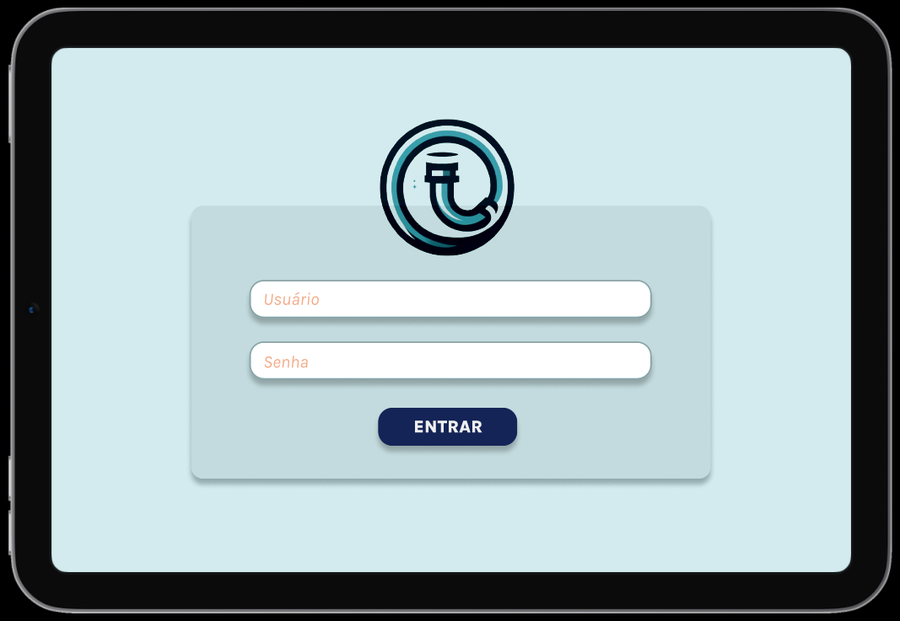
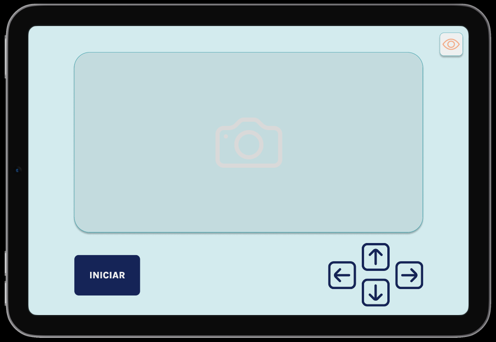
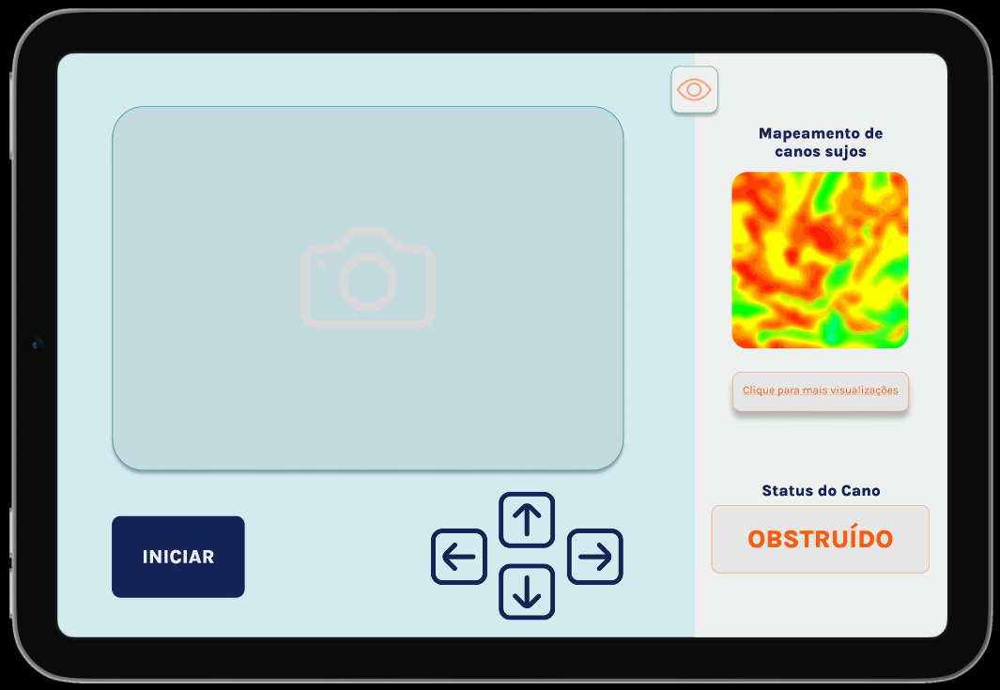
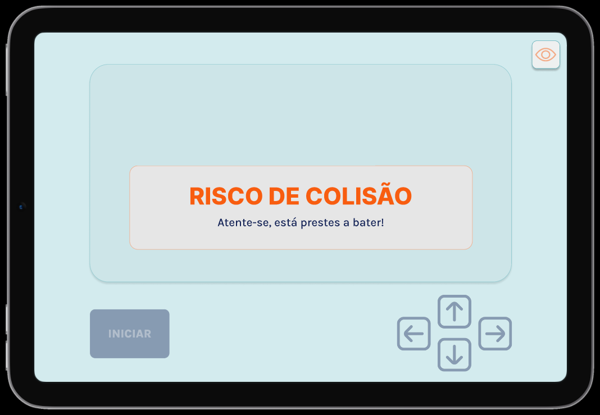

# Introdução
Nesta seção, apresentaremos o mockup desenvolvido para a interface gráfica da aplicação. Após a criação inicial do wireframe, que permitiu visualizar as funcionalidades principais, avançamos para a elaboração de um protótipo de alta fidelidade. Este mockup oferece uma visão detalhada do design final da aplicação, permitindo uma melhor compreensão de sua aparência e interação sem a necessidade de desenvolvimento do frontend. Além disso, ajustes foram realizados com base nos feedbacks recebidos, assegurando que o produto final esteja alinhado com as expectativas e necessidades dos usuários.

### Imagem 1 do Mockup - tela de login

<h6 align="center"> Fonte: Elaboração grupo Repipe </h6>
A tela de login no mockup mantém a simplicidade funcional do wireframe, com campos para "Usuário" e "Senha" e um botão "ENTRAR". O design visual é mais detalhado, com o logo da empresa mais proeminente e um esquema de cores mais definido, reforçando a identidade visual da aplicação.

### Imagem 2 do Mockup - tela principal

<h6 align="center"> Fonte: Elaboração grupo Repipe </h6>
A tela principal do mockup mantém a mesma estrutura do wireframe, mostra um layout mais elaborado, com a imagem captada pela câmera do robô exibida e botões de controle direcional com ícones intuitivos. O botão "INICIAR" agora é destacado, facilitando o acesso do usuário às funcionalidades principais da aplicação.

### Imagem 3 do Mockup - tela de visualização

<h6 align="center"> Fonte: Elaboração grupo Repipe </h6>
A tela de visualização no mockup segue a mesma abordagem do wireframe, só que com a identidade visual do projeto aplicada na tela. A aba de visualização fornece informações sobre o status dos canos através de um mapa de calor, um botão para acessar outros gráficos para análise mais aprofundada. Além disso, ela exibe o status do cano, o qual é determinado por meio de uma comparação com imagens em um banco de dados. Este design melhora significativamente a usabilidade, fornecendo ao usuário informações claras e acessíveis em tempo real.

### Imagem 2 do Mockup - modal colisão

<h6 align="center"> Fonte: Elaboração grupo Repipe </h6>
A tela de alerta de colisão no mockup é muito importante para segurança, projetada para alertar imediatamente o usuário sobre potenciais riscos de colisão. Este alerta é apresentado por um pop-up destacado em cores vivas para assegurar máxima visibilidade e atenção. O texto "RISCO DE COLISÃO - Atente-se, está prestes a bater!" é claro e direto, minimizando a possibilidade de mal-entendidos e aumentando a rapidez na reação do usuário.

### Vídeo do Fluxo do Mockup
A seguir tem-se um gif que representa o fluxo do mockup para melhor entendimento de como o frontend será implementado.

<h6 align="center"> Fonte: Elaboração grupo Repipe </h6>

# Conclusão
A criação do mockup de alta fidelidade é um passo crucial no desenvolvimento da interface gráfica, pois permite uma visualização clara e detalhada do design da aplicação antes da implementação do frontend. Com base nos feedbacks recebidos, ajustes foram feitos para garantir que o produto final não só atenda às expectativas dos usuários, mas também ofereça uma experiência intuitiva e agradável. As imagens apresentadas, juntamente com o vídeo do fluxo do mockup, fornecem uma visão abrangente de como a aplicação funcionará, destacando o cuidado com a usabilidade e a identidade visual do projeto.
