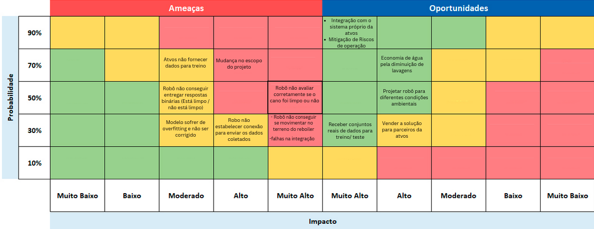

# Matriz de Riscos

A matriz de riscos é uma ferramenta essencial na gestão de projetos que permite identificar, classificar e gerenciar os potenciais riscos durante todo o ciclo de vida de um projeto, o que significa que ela está sempre sujeita a alterações de acordo com os acontecimentos ao longo do projeto. Ela é estruturada para visualizar a probabilidade de ocorrência de cada risco contra o impacto que ele pode ter no projeto, facilitando assim a priorização das ações de mitigação. Além disso, também são inclúidas possibilidades que podem aumentar ainda mais o valor do projeto, sendo essas possibilidades incluídas na parte de oportunidades. 

## Planos de Prevenção e Ataque

Além da elaboração da matriz, é elaborado tanto um plano de prevenção (para evitar que o risco aconteça) tanto um plano de ataque (para se preparar com a possibilidade do risco se tornar realidade) para cada risco.

### 1. Atvos não fornecer dados reais do reboiler para treinamento do robô
- **Prevenção**: Tentar combinar com eles o mais cedo possível e validar a hipótese de recebermos dados deles para o treinamento.
- **Ataque**: Caso não seja possível utilizar dados da Atvos, utilizar dados sintéticos / mockados para o treinamento do modelo.

### 2. Mudança no escopo do projeto com o recebimento da TAPI
- **Prevenção**: Definir claramente o escopo nos encontros com a atvos.
- **Ataque**: Reavaliar e adaptar o planejamento do projeto de acordo com os encontros e a TAPI e realocar prioridades conforme necessário.

### 3. Robô ter dificuldade para definir se o cano necessita ou não de uma segunda limpeza  (Não ser S/N)
- **Prevenção**: Desenvolver um algoritmo robusto de visão computacional buscando confirmar ao máximo a necessidade de uma segunda lavagem.
- **Ataque**: Conversar com o parceiro sobre a situação, e dentro das capacidades de avaliação do algoritmo, definir um "número mínimo de sujeira detectada" que demonstraria a necessidade de uma segunda lavagem.

### 4. Robô categorizar bem os canos que necessitam ser limpos no momento de teste mas não se adaptar com casos reais
- **Prevenção**: Utilizar técnicas de validação cruzada e regularização durante o desenvolvimento do modelo.
- **Ataque**: Reajustar o modelo com novos dados e revisar a abordagem de treinamento, procurando sempre remover qualquer viés no conjunto de dados de treinamento que possa atrapalhar o funcionamento da solução.

### 5. Robô não estabelecer conexão para enviar os dados coletados
- **Prevenção**: Implementar mecanismos de reconexão automática e sistemas de backup para transferência de dados.
- **Ataque**: Armazenar dados localmente no robô até que a conexão seja restabelecida ou transferir manualmente.

### 6. Robô apontar erroneamente se um cano está sujo ou não (Cano sujo está limpo ou o contrário)
- **Prevenção**: Refinar algoritmos de avaliação e realizar testes extensivos em diversas condições.
- **Ataque**: Recalibrar o sistema de visão do robô e realizar inspeções de controle de qualidade, sempre re-testando os algoritmos de leitura a cada mudança feita neles.

### 7. Robô não conseguir se movimentar no terreno do reboiler
- **Prevenção**: Desenhar o robô para lidar com diferentes terrenos e realizar testes de mobilidade.
- **Ataque**: Fazer ajustes técnicos no robô ou mudar a estratégia de inserção no ambiente.

