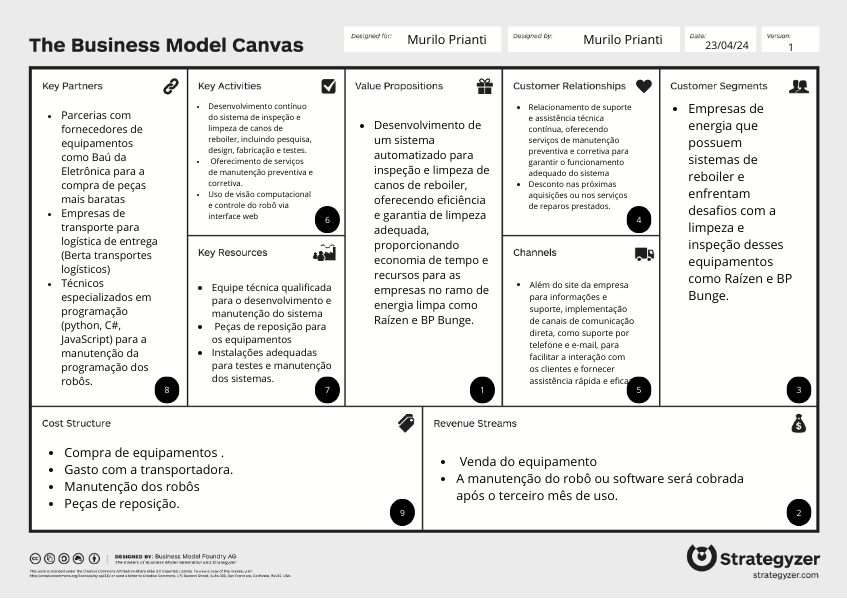

# Business Model Canvas (BMC)
O Business Model Canvas (BMC) é uma ferramenta poderosa para ajudar no planejamento e desenvolvimento de negócios de forma estratégica e eficiente. Ele oferece uma visão panorâmica e estruturada de um empreendimento, permitindo que empreendedores, gestores e equipes analisem e iterem sobre seu modelo de negócio de maneira mais clara e concisa.
No nosso caso podemos fazer com que o BMC nos auxilie para que possamos ajustar o nosso projeto através dos nove campos de trabalho que a matriz tem.

Ao usar o BMC, você pode dividir o processo de planejamento em nove blocos principais, cada um representando um aspecto fundamental do seu negócio:

### 1 Value Propositions: 
Desenvolvimento de um sistema automatizado para inspeção e limpeza de canos de reboiler, oferecendo eficiência e garantia de limpeza adequada, proporcionando economia de tempo e recursos para as empresas no ramo de energia limpa como Raízen e BP Bunge.

### 2 Revenue Streams: 
Venda do equipamento desenvolvido.
A manutenção do robô ou software será cobrada após o terceiro mês de uso.

### 3 Customer Segments:
Empresas de energia que possuem sistemas de reboiler e enfrentam desafios com a limpeza e inspeção desses equipamentos como Raízen e BP Bunge.

### 4 Customer Relationships: 
Estabelecimento de um relacionamento de suporte e assistência técnica contínua, oferecendo serviços de manutenção preventiva e corretiva para garantir o funcionamento adequado do sistema.
Desconto nas próximas aquisições ou nos serviços de reparos prestados.

### 5 Channels:
Além do site da empresa para informações e suporte, implementação de canais de comunicação direta, como suporte por telefone e e-mail, para facilitar a interação com os clientes e fornecer assistência rápida e eficaz.

### 6 Key activities:
Desenvolvimento contínuo do sistema de inspeção e limpeza de canos de reboiler, incluindo pesquisa, design, fabricação e testes.
Oferecimento de serviços de manutenção preventiva e corretiva.
Uso de visão computacional e controle do robô via interface web.

### 7 Key Resources:
Equipe técnica qualificada para o desenvolvimento e manutenção do sistema, peças de reposição para os equipamentos, e instalações adequadas para testes e manutenção dos sistemas.

### 8 Key partners:
Parcerias com fornecedores de equipamentos como Baú da Eletrônica para a compra de peças mais baratas
Empresas de transporte para logística de entrega (Berta transportes logísticos).
Técnicos especializados em programação (python, C#, JavaScript) para a manutenção da programação dos robôs.

### 9 Cost structure:
Investimento inicial em equipamentos e materiais para o desenvolvimento do sistema.
Custos de transporte, manutenção dos equipamentos tanto em hardware como em software.
Aquisição de peças de reposição (motores, sensores).

