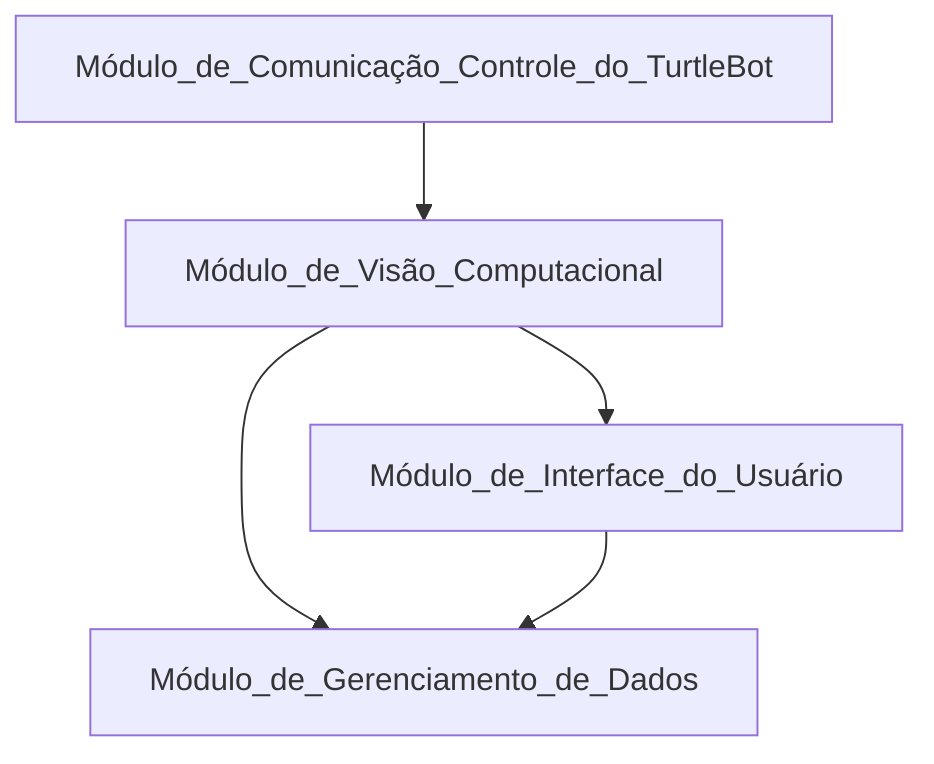

# Proposta Inicial da Arquitetura  
A proposta inicial da arquitetura visa fornecer uma estrutura básica para o sistema, definindo módulos, a integração entre eles e apresentando um diagrama que ilustre essa arquitetura. A qualidade da proposta será avaliada com base na sua adequação aos requisitos do projeto e na sua capacidade de fornecer uma visão clara e abrangente da arquitetura do sistema.

## Descrição dos Módulos
Os módulos referem-se às partes ou componentes do sistema que desempenham funções específicas e distintas dentro da arquitetura proposta. Cada módulo é responsável por uma parte do processo ou por uma funcionalidade do sistema.

### Módulo de Comunicação Controle do TurtleBot
Este módulo será implementado utilizando o ROS (Robot Operating System), que é uma plataforma de código aberto amplamente utilizada para o desenvolvimento em robótica. Ele enviará comandos ao TurtleBot e receberá feedbacks sobre a localização e o estado da limpeza dos tubos. Para a comunicação com outros módulos, serão utilizados serviços ROS.

### Módulo de Visão Computacional
Este módulo será responsável por processar as imagens capturadas pela câmera acoplada ao TurtleBot. Utilizando bibliotecas como OpenCV em conjunto com Python, será realizado o processamento de imagens para identificar a sujeira nos tubos do reboiler. Este módulo também atuará como o backend do sistema, fornecendo dados sobre a localização da sujeira e coordenadas para o controle do TurtleBot.

### Módulo de Interface do Usuário
Este módulo será responsável por armazenar e gerenciar os dados coletados durante o processo de limpeza, o que será feito por meio do PostgreSQL. Será implementado utilizando um banco de dados, proporcionando uma estrutura flexível e escalável para o armazenamento dos registros históricos de limpeza e dos dados das operações anteriores. Conforme esclarecido no workshop, a empresa já possui uma interface capaz de gerar os dashboards para visualização dos dados coletados. Assim, forneceremos apenas uma API para a comunicação com o Módulo de Visão Computacional e o Módulo de Gerenciamento de Dados, que será desenvolvida em FastAPI.

### Módulo de Gerenciamento de Dados
Este módulo será responsável por armazenar e gerenciar os dados coletados durante o processo de limpeza, isso será feito por meio do PostgreSQL. Será implementado utilizando um banco de dados, proporcionando uma estrutura flexível e escalável para armazenamento dos registros históricos de limpeza e dos dados das operações anteriores. Conforme esclarecido no workshop a empresa já possui uma interface capaz de gerar os dashboards para visualização dos dados coletados. Assim, forneceremos apenas uma API para comunicação com o Módulo de Visão Computacional e o Módulo de Gerenciamento de Dados, que será desenvolvida em FastAPI.

## Integração entre os Módulos
Para integrar os módulos, precisamos estabelecer as conexões e comunicações adequadas entre eles.

### 1. Comunicação Controle do TurtleBot -> Módulo de Visão Computacional
- O módulo de comunicação enviará comandos para o TurtleBot, solicitando a captura de imagens da câmera acoplada.
- O módulo de visão computacional processará as imagens recebidas utilizando OpenCV para identificar a presença de sujeira nos tubos do reboiler.

### 2. Módulo de Visão Computacional -> Módulo de Interface do Usuário
- Após o processamento das imagens, o módulo de visão computacional enviará os dados sobre a localização da sujeira e coordenadas relevantes para o módulo de interface do usuário.
- O módulo de interface do usuário exibirá em tempo real a visão da câmera e as informações sobre a sujeira identificada, permitindo aos operadores monitorar o processo de limpeza e enviar comandos de movimento para o TurtleBot, se necessário.

### 3. Módulo de Interface do Usuário -> Módulo de Gerenciamento de Dados
- O módulo de interface do usuário enviará os dados de feedback sobre o progresso e o estado atual do processo de limpeza para o módulo de gerenciamento de dados.
- O módulo de gerenciamento de dados armazenará esses registros históricos de limpeza e dados das operações anteriores em um banco de dados.

### 4. Módulo de Visão Computacional -> Módulo de Gerenciamento de Dados
- Além disso, o módulo de visão computacional enviará os dados sobre a localização da sujeira e coordenadas relevantes diretamente para o módulo de gerenciamento de dados.
- Isso garantirá que todas as informações sobre o processo de limpeza sejam registradas e armazenadas de forma eficiente.

### 5. Integração Geral
- A comunicação entre os módulos será facilitada pelo uso de serviços ROS para troca de mensagens entre o módulo de comunicação controle do TurtleBot e o módulo de visão computacional.
- Para a interface do usuário, o módulo de interface será desenvolvido utilizando React.js, proporcionando uma experiência interativa e responsiva para os operadores.
- A API para comunicação entre o módulo de visão computacional e o módulo de gerenciamento de dados será implementada em FastAPI, garantindo uma comunicação eficiente e uma estrutura flexível para a gestão dos dados coletados.

## Diagrama de Arquitetura

<h6> Fonte: Elaboração Grupo Repipe </h6>