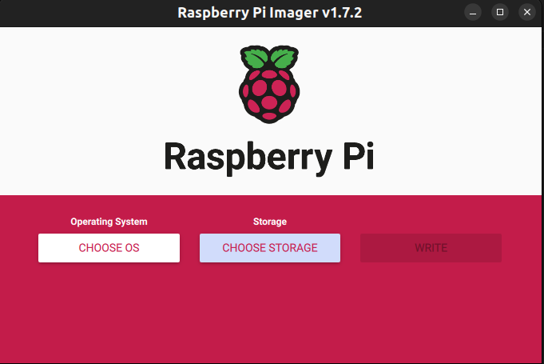
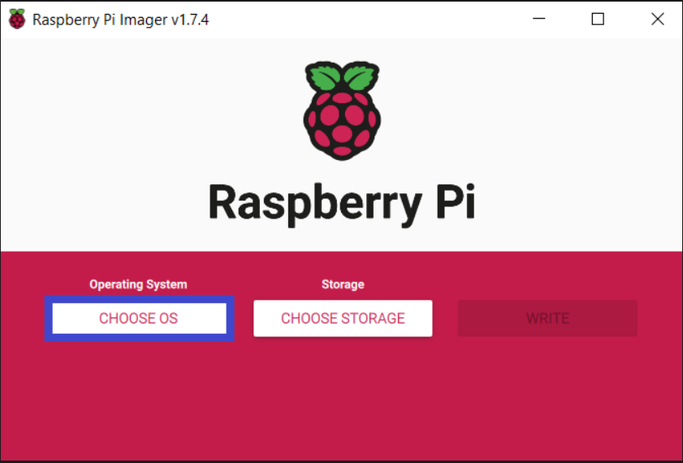
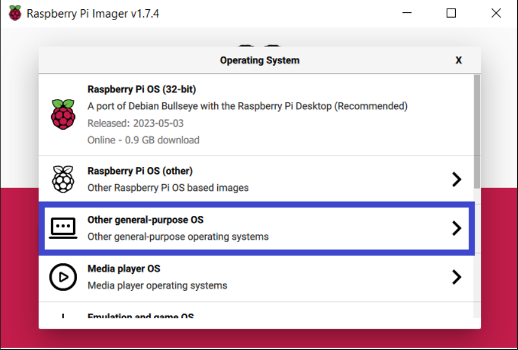
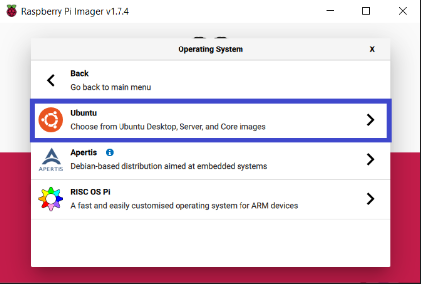
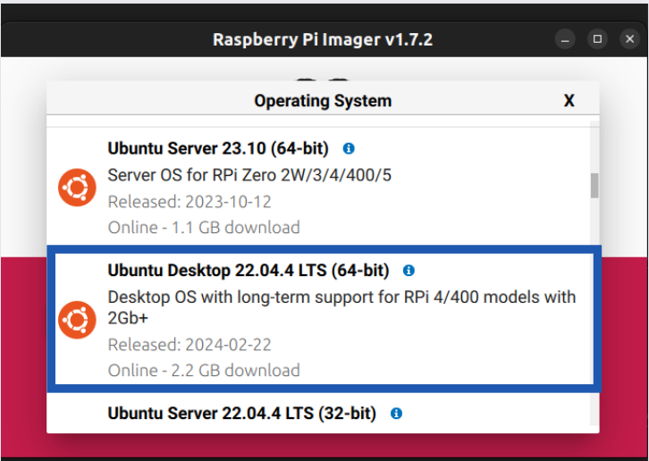
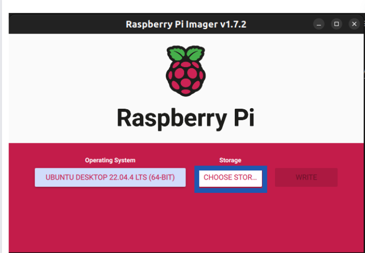
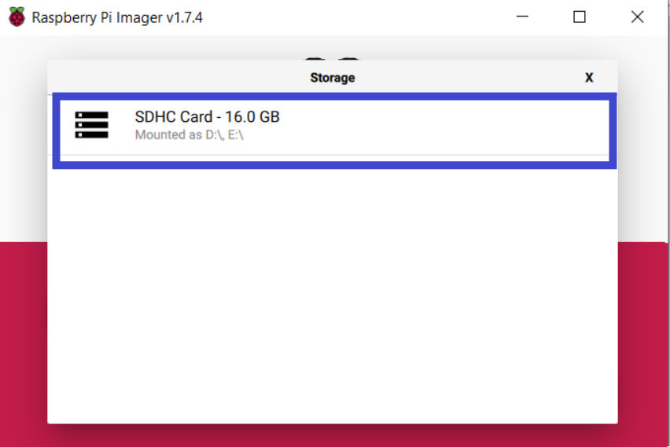
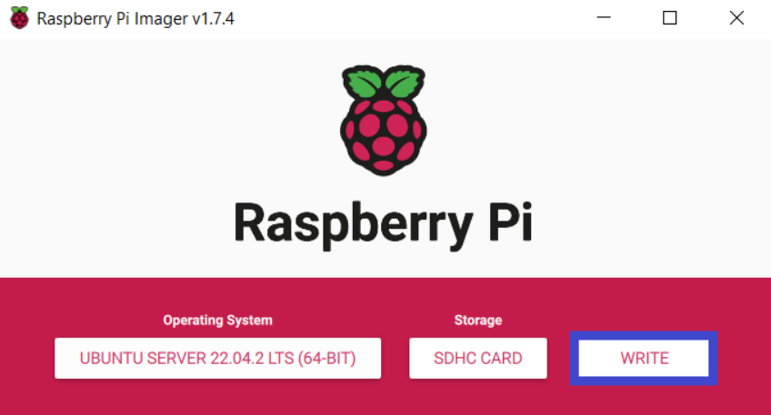

# Metodologia

A metodologia adotada nessa etapa do projeto começou com a posse de um robô TurtleBot3, previamente montado e continha um primeiramente foi de estar em posse de um robô TurtleBot3 que estava montado e equipado com um micro cartão SD. Nesse sentido, o primeiro passo foi remover o micro cartão SD do robô e inseri-lo em um notebook. 

Para a configuração inicial do sistema, foi utilizada a documentação fornecida por Rodrigo Mangoni Nicola, disponível em: `https://rmnicola.github.io/m6-ec-encontros/setupturtle`.

Em seguida, foi feito o download da imagem do Raspberry Pi Imager, disponível nesse [`link`](https://www.raspberrypi.com/software/), para gravá-la no micro cartão SD. Na seção **Operating System**, foi escolhido o Ubunto Desktop 22.04.4 LTS (x86 - 64 bits) e para o **Storage**, foi escolhido o micro cartão SD.

Essa etapa pode ser vista com detalhes adicionais nas Imagens 1 a 8.

Na Imagem 1, apresentam-se as primeiras impressões da interface do Raspberry Pi Imager, marcando o início do processo de instalação do sistema.

<h2 align="center"> Imagem 1 - Tela incial do Raspberry Pi </h2>

<h6 align="center"> Fonte: Raspberry Pi Imager </h6>

Na imagem 2, é possível observar a opção para selecionar o sistema operacional desejado com o qual se pretende trabalhar.

<h2 align="center"> Imagem 2 - Seleção do Operating System </h2>

<h6 align="center"> Fonte: Material de Rodrigo Mangoni Nicola. Disponível em: (https://rmnicola.github.io/m6-ec-encontros/setupturtle) </h6>

Na Imagem 3, encontra-se a opção para selecionar um sistema operacional diferente que não está disponível na tela inicial. Clique nela para acessar outras opções disponíveis.

<h2 align="center"> Imagem 3 - Seleção de outro sistema </h2>

<h6 align="center"> Fonte: Material de Rodrigo Mangoni Nicola. Disponível em: (https://rmnicola.github.io/m6-ec-encontros/setupturtle) </h6>

<h2 align="center"> Imagem 4 - Seleção do Ubuntu </h2>

<h6 align="center"> Fonte: Material de Rodrigo Mangoni Nicola. Disponível em: (https://rmnicola.github.io/m6-ec-encontros/setupturtle) </h6>

Na Imagem 5, foi selecionada a opção do Ubuntu que foi utilizada na aplicação.

<h2 align="center"> Imagem 5 - Seleção da versão do Ubuntu </h2>

<h6 align="center"> Fonte: Raspberry Pi Imager </h6>

Após essas etapas é necessário seleconar o **Storage** que aparecerá a primeira opção que a entrada do micro cartão SD está lendo. 

<h2 align="center"> Imagem 6 - Seleção do Storage </h2>

<h6 align="center"> Fonte: Raspberry Pi Imager </h6>

Na Imagem 7, está sendo selecionada a unidade na qual se deseja gravar a imagem do sistema operacional escolhido.

<h2 align="center"> Imagem 7 - Seleção do micro cartão SD </h2>

<h6 align="center"> Fonte: Material de Rodrigo Mangoni Nicola. Disponível em: (https://rmnicola.github.io/m6-ec-encontros/setupturtle) </h6>

Na Imagem 8, a tarefa de instalação do sistema operacional no micro cartão SD foi concluída. Após a finalização da instalação, remova o micro cartão SD do notebook/computador e insira-o novamente no TurtleBot3.

<h2 align="center"> Imagem 8 - Seleção do micro cartão SD </h2>

<h6 align="center"> Fonte: Material de Rodrigo Mangoni Nicola. Disponível em: (https://rmnicola.github.io/m6-ec-encontros/setupturtle) </h6>

Após esse processo, o TurtleBot3 foi ligado com o micro cartão SD inserido, dando início à configuração do Ubuntu. As telas para configuração foram ajustadas conforme o que o grupo visou necessário, ou seja, colocando nome de usuário, senha, conexão de rede, entre outros aspectos.

Após isso, o ROS foi instalado com base no material fornecido por Rodrigo Mangoni Nicola, disponível em: `https://rmnicola.github.io/m6-ec-encontros/E01/ros`. Para isso, foram utilizados os seguintes comandos no temrinal:

**1-** `sudo apt-add-repository universe` 

**2-** `sudo curl -sSL https://raw.githubusercontent.com/ros/rosdistro/master/ros.key -o /usr/share/keyrings/ros-archive-keyring.gpg` 

**3-** `echo "deb [arch=$(dpkg --print-architecture) signed-by=/usr/share/keyrings/ros-archive-keyring.gpg] http://packages.ros.org/ros2/ubuntu $(. /etc/os-release && echo $UBUNTU_CODENAME) main" | sudo tee /etc/apt/sources.list.d/ros2.list > /dev/null` 

**4-** `echo "deb [arch=$(dpkg --print-architecture) signed-by=/usr/share/keyrings/ros-archive-keyring.gpg] http://packages.ros.org/ros2/ubuntu $(. /etc/os-release && echo $UBUNTU_CODENAME) main" | sudo tee /etc/apt/sources.list.d/ros2.list > /dev/null` 

**5-** `sudo apt update` 

**6-** `sudo apt install ros-humble-desktop` 

**7-** `echo "source /opt/ros/humble/setup.bash" >> ~/.bashrc` 
