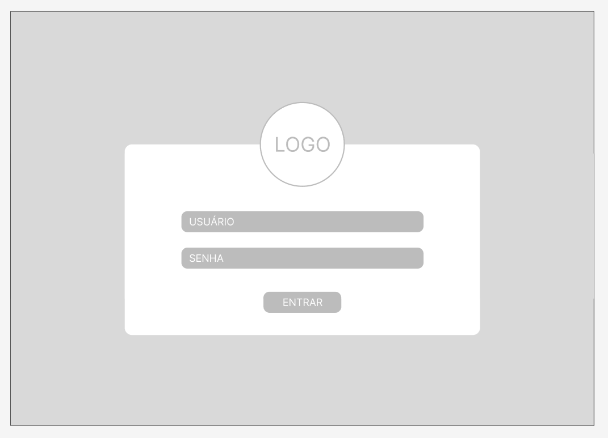
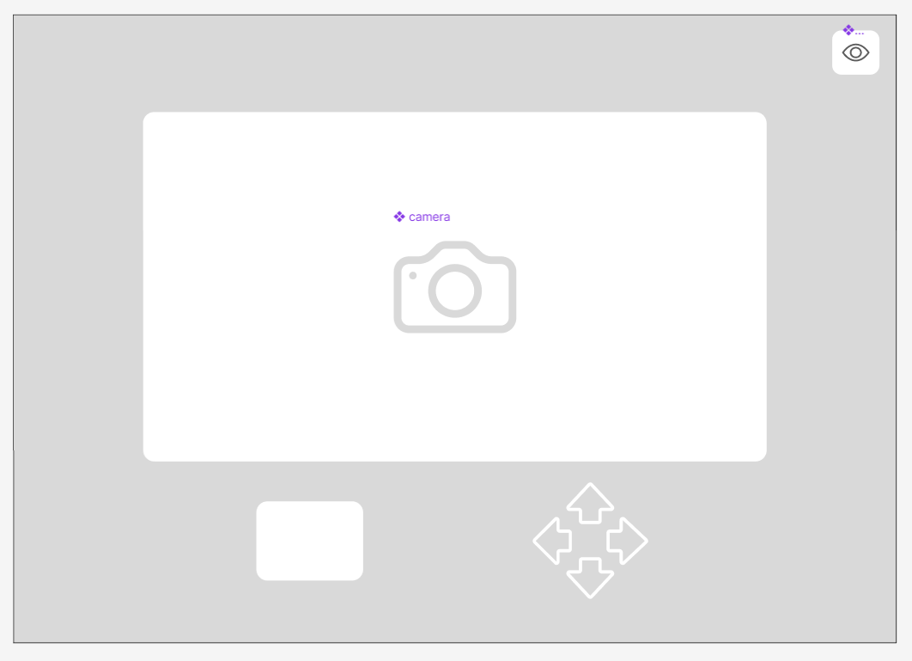
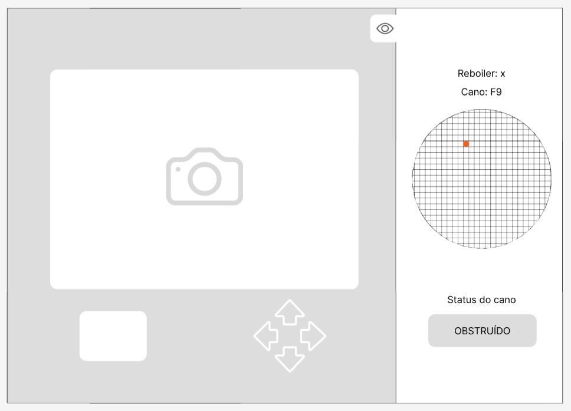
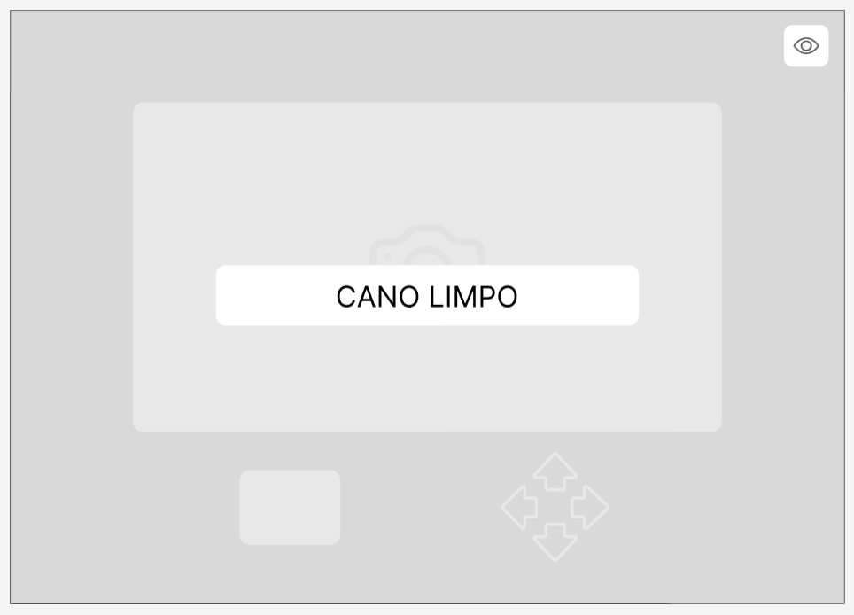
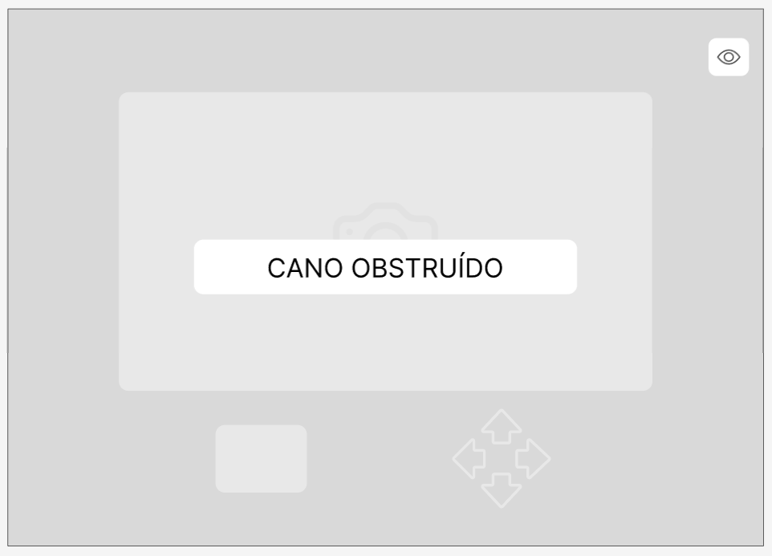

### Wireframe 
Para avançarmos no desenvolvimento de uma interface gráfica, achamos necessários já planejar uma interface gráfica. Então, prototipamos um wireframe onde é possível ver as principais funcionalidades da aplicação. 

#### Imagem 1 do Wireframe - tela de login

#### Imagem 2 do Wireframe - tela principal

#### Imagem 3 do Wireframe - tela de visualização

#### Imagem 4 do Wireframe - tela de limpo

#### Imagem 5 do Wireframe - tela de obstruído

(Explicaremos um por um)