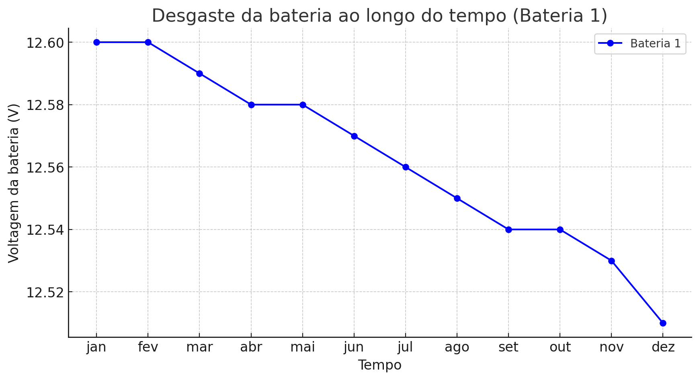
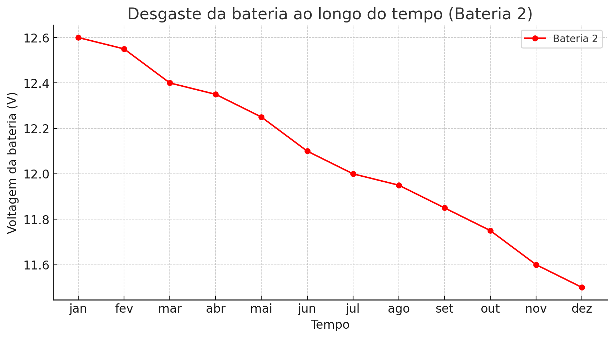

# Explicação da Latência no Projeto

## Introdução

Este documento tem como objetivo explicar a função de latência implementada no projeto de publicação de frames de vídeo usando ROS 2 (Robot Operating System). No contexto deste projeto, a latência refere-se ao tempo de atraso entre a captura de um frame pela câmera e a publicação deste frame como uma mensagem no tópico ROS. Entender e monitorar essa latência é crucial para aplicações em que o tempo real é um fator importante, como robótica, vigilância e sistemas de controle.

## Funcionamento da latência no projeto

A latência é um fator crítico em sistemas de visão computacional e robótica, onde decisões baseadas em vídeo precisam ser tomadas rapidamente. Monitorar a latência ajuda a:

**Avaliar o Desempenho:** Identificar gargalos no sistema que podem atrasar o processamento de vídeo.

**Melhorar a Qualidade do Serviço:** Ajustar parâmetros do sistema para reduzir a latência e melhorar a resposta em tempo real.

**Diagnosticar Problemas:** Detectar problemas com a câmera ou o sistema de captura que possam estar introduzindo atrasos inesperados.

# Dados e possiveis gráficos para a visualização da Latência (em tempo real):


# Conclusão
A função latencia implementada neste projeto é essencial para monitorar e otimizar a latência na captura e publicação de frames de vídeo. A medição contínua e a exibição da latência permitem identificar e corrigir problemas rapidamente, garantindo que o sistema funcione de maneira eficiente e responsiva.


# Explicação sobre a Bateria no projeto

## Introdução
Este documento tem como objetivo explicar a função da bateria e como as pessoas que estão operando o robô podem interfirir na vida útil da mesma. Lembrando sempre que estamos usando uma bateria de lítio então o mal uso pode ocorrer uma explosão (em pequena escala, claro, por conta do robô e a bateria serem pequenos). A seguir vamos falar mais sobre a bateria que estamos usando e o que devemos fazer para prolongar o período de vida útil dela tambem colocaremos um gráfico informativo sobre a vida útil dela, tomando e não tomando os devidos cuidados.

## Expecificações da bateria
- Modelo: LB-12
- Li-po 11.1V (pode ser carregada até 12.6V)
- 1800 mAh
- 3 células com 3,7V cada
- Peso: 106g
- Tamano: 88mm x 35mm x 26mm

# Bateria LB-12 (cuidando adequadamente)
Para prolongar a vida útil da bateria do modelo LB-12, é importante entender que esta bateria possui 3 células de 3,7 volts cada. Para carregá-la corretamente, utilizamos um carregador específico, o "Lipro Balance Charger" modelo "iMAX B6", que permite carregar as células de maneira uniforme.

Além disso, é crucial monitorar o nível de carga da bateria. O TurtleBot possui um mecanismo de segurança que emite um som de alerta quando a voltagem da bateria atinge 11V.

Abaixo, apresentamos um gráfico que representa a vida útil da bateria ao longo do tempo, considerando todos os cuidados necessários. Este gráfico mostra a voltagem da bateria em função do tempo, ajudando a monitorar e manter a saúde da bateria a longo prazo:



# Bateria LB-12 (Não cuidando adequadamente)
Ao não seguir as práticas recomendadas para o cuidado da bateria LB-12, diversos problemas podem surgir, comprometendo tanto a eficiência quanto a vida útil da bateria. A LB-12 é composta por 3 células de 3,7 volts cada, e o uso inadequado pode causar desequilíbrios entre essas células.

Além disso, ignorar o monitoramento do nível de carga da bateria pode ser prejudicial. O TurtleBot possui um alerta sonoro de segurança que avisa quando a voltagem da bateria cai para 11V. Ignorar esses avisos e permitir que a voltagem caia ainda mais pode danificar permanentemente as células da bateria, reduzindo sua capacidade e eficiência.

Abaixo, apresentamos um gráfico que ilustra a vida útil da bateria ao longo do tempo sem os cuidados adequados. Este gráfico mostra a degradação acelerada da voltagem da bateria devido à falta de manutenção apropriada, destacando a importância de seguir as práticas recomendadas para garantir a longevidade da bateria:



**OBS: Vale lembrar que se a voltagem da bateria ficar abaixo de 10V ela não funciona mais, ela incha por ser de lítio e para de funcinar e inchando é possível que exploda**

## Script para a obtenção dos gráficos
Para conseguir plotar os mesmos gráficos que estão acima, usa-se esse código em python:
```python
import pandas as pd
import matplotlib.pyplot as plt

# Dados da primeira tabela atualizada
data1 = {
    "Tempo": ["jan", "fev", "mar", "abr", "mai", "jun", "jul", "ago", "set", "out", "nov", "dez"],
    "Voltagem da bateria": [12.6, 12.6, 12.59, 12.58, 12.58, 12.57, 12.56, 12.55, 12.54, 12.54, 12.53, 12.51]
}

# Dados da segunda tabela atualizada
data2 = {
    "Tempo": ["jan", "fev", "mar", "abr", "mai", "jun", "jul", "ago", "set", "out", "nov", "dez"],
    "Voltagem da bateria": [12.6, 12.55, 12.4, 12.35, 12.25, 12.10, 12, 11.95, 11.85, 11.75, 11.6, 11.5]
}

# Criar dataframes
df1 = pd.DataFrame(data1)
df2 = pd.DataFrame(data2)

# Plotando o primeiro gráfico com a voltagem em volts
plt.figure(figsize=(10, 5))
plt.plot(df1["Tempo"], df1["Voltagem da bateria"], marker='o', linestyle='-', color='b', label='Bateria 1')
plt.xlabel('Tempo')
plt.ylabel('Voltagem da bateria (V)')
plt.title('Desgaste da bateria ao longo do tempo (Bateria 1)')
plt.legend()
plt.grid(True)
plt.show()

# Plotando o segundo gráfico com a voltagem em volts
plt.figure(figsize=(10, 5))
plt.plot(df2["Tempo"], df2["Voltagem da bateria"], marker='o', linestyle='-', color='r', label='Bateria 2')
plt.xlabel('Tempo')
plt.ylabel('Voltagem da bateria (V)')
plt.title('Desgaste da bateria ao longo do tempo (Bateria 2)')
plt.legend()
plt.grid(True)
plt.show()
```

# Conclusão
Cuidar adequadamente da bateria LB-12 é crucial para garantir a segurança e a eficiência do TurtleBot. Utilizar um carregador balanceador adequado e monitorar o nível de carga regularmente prolonga a vida útil da bateria e evita riscos, como explosões. Negligenciar esses cuidados resulta em degradação acelerada, perda de capacidade e possíveis danos irreparáveis. Seguir as práticas recomendadas é essencial para manter o robô funcionando de maneira eficiente e segura.
