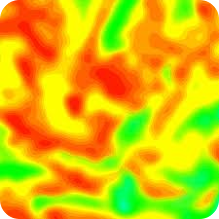
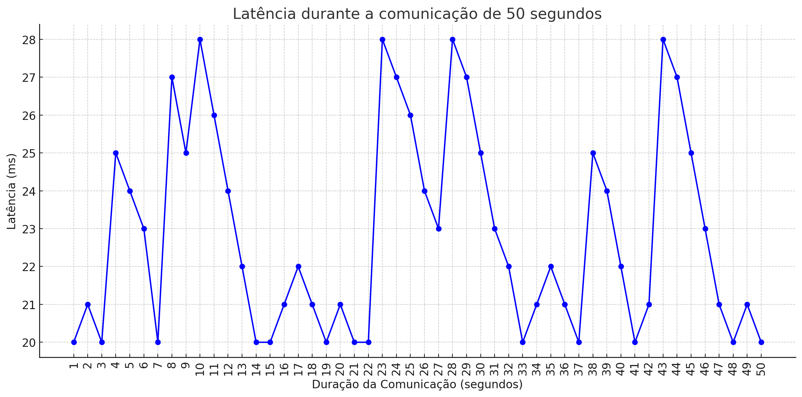

# Sugestão de gráficos para Atvos
A documentação a seguir apresenta uma análise detalhada e visual dos dados coletados ao longo do projeto feito para a empresa Atvos. Com o objetivo de proporcionar uma visão abrangente e precisa do progresso e dos resultados obtidos, foram gerados diversos gráficos que ilustram os principais indicadores de desempenho.

Nesta etapa do projeto, há muitos dados a serem analisados, os quais requerem uma visualização adequada para serem plenamente compreendidos. 

Essas sugestões de gráficos fornecem ferramentas com as quais a empresa Atvos pode obter insights valiosos, facilitando uma tomada de decisão mais informada e estratégica. A visualização dos dados facilita a identificação de padrões, tendências e possíveis áreas de melhoria, contribuindo para a otimização dos processos e a maximização dos resultados.

Além disso, os gráficos aqui apresentados podem ser integrados a um sistema de Business Intelligence (BI), oferecendo uma visão dinâmica de como as iniciativas implementadas estão evoluindo. Com isso, a Atvos poderá monitorar o desempenho em tempo real, ajustando suas estratégias conforme necessário e assegurando que os objetivos do projeto sejam alcançados de maneira eficiente e eficaz.

Portanto, esta documentação não apenas serve como um registro detalhado das atividades e resultados, mas também como uma base para a construção de um BI, fundamental para o sucesso contínuo da Atvos.

Nota: os scripts para a geração dos gráficos foram criados manualmente como base e ainda não estão integrados diretamente à solução atual. O objetivo é apresentar sugestões e possíveis aplicações, que poderiam ser integradas em etapas futuras.

## Explicação da API da câmera no projeto

### Introdução
Uma câmera será utilizada para visualizar os canos do reboiler, possibilitando a identificação de sujeiras e obstruções. No contexto deste projeto, a capacidade de capturar imagens é essencial para a detecção das impurezas e manutenção preventiva eficiente. A implementação desta tecnologia é crucial para assegurar a integridade operacional dos reboilers, reduzindo o risco de falhas e otimizando os processos de limpeza e manutenção.

### Funcionamento da câmera no projeto
Para entendermos melhor a transmissão de dados de imagem para a nossa página web, a câmera está conectada com essa a página via websocket (é uma tecnologia que permite a comunicação bidirecional por canais full-duplex sobre um único soquete Transmission Control Protocol).
A imagem é capturada pela câmera e enviada para o servidor web, que a armazena em um arquivo temporário.
Com isso, podemos gerar um gráfico partindo das imagens que foram armazenadas no banco de dados.

### Mapa de calor partindo das imagens da câmera
Com base nas imagens analisadas pela câmera, idealizou-se que um gráfico de calor seria uma boa forma de representar os pontos de sujeira.
O objetivo dessas imagens é poder demonstrar a situação dos canos em relação a sujeira, as manchas vermelhas são os pontos que contém mais sujeira, já os pontos em verde são as partes que estão, de certa forma, limpas.

<div align="center">



<h6 align="center"> Fonte: Elaboração Grupo Repipe </h6>

</div>

**OBS: Esse funcionamento de visão computacional mostrando o mapa de calor detectando as sujeiras é uma funcionalidade que ainda será trabalhada para poder implementar no projeto. Essa é uma imagem meramente ilustrativa**

### Conclusão
A implementação da câmera no projeto de inspeção dos canos do reboiler desempenha um papel crucial na identificação e monitoramento de sujeiras e obstruções, facilitando a manutenção preventiva e assegurando a eficiência operacional. A integração da câmera com a página web via websocket permite uma transmissão de dados de imagem eficiente, possibilitando o armazenamento e análise das imagens capturadas. A utilização de mapas de calor, embora ainda em fase de desenvolvimento, promete aprimorar significativamente a visualização e a identificação das áreas mais críticas em termos de sujeira. Assim, o uso dessa tecnologia representa um avanço importante na manutenção dos reboilers, potencialmente prolongando a vida útil dos equipamentos e reduzindo o risco de falhas operacionais.

## Explicação sobre a Bateria no projeto

### Introdução
Aqui temos como objetivo explicar a função da bateria e como as pessoas que estão operando o robô podem interfirir na vida útil da mesma. Lembrando sempre que estamos usando uma bateria de lítio então o mal uso pode ocorrer uma explosão (em pequena escala, claro, por conta do robô e a bateria serem pequenos). A seguir vamos falar mais sobre a bateria que estamos usando e o que devemos fazer para prolongar o período de vida útil dela tambem colocaremos um gráfico informativo sobre a vida útil dela, tomando e não tomando os devidos cuidados.

### Expecificações da bateria
- Modelo: LB-12
- Li-po 11.1V (pode ser carregada até 12.6V)
- 1800 mAh
- 3 células com 3,7V cada
- Peso: 106g
- Tamano: 88mm x 35mm x 26mm

### Bateria LB-12 (cuidando adequadamente)
Para prolongar a vida útil da bateria do modelo LB-12, é importante entender que esta bateria possui 3 células de 3,7 volts cada. Para carregá-la corretamente, utilizamos um carregador específico, o "Lipro Balance Charger" modelo "iMAX B6", que permite carregar as células de maneira uniforme.

Além disso, é crucial monitorar o nível de carga da bateria. O TurtleBot possui um mecanismo de segurança que emite um som de alerta quando a voltagem da bateria atinge 11V.

Abaixo, apresentamos um gráfico que representa a vida útil da bateria ao longo do tempo, considerando todos os cuidados necessários. Este gráfico mostra a voltagem da bateria em função do tempo, ajudando a monitorar e manter a saúde da bateria a longo prazo:


<h6 align="center"> Fonte: Elaboração Grupo Repipe </h6>


### Bateria LB-12 (Não cuidando adequadamente)
Ao não seguir as práticas recomendadas para o cuidado da bateria LB-12, diversos problemas podem surgir, comprometendo tanto a eficiência quanto a vida útil da bateria. A LB-12 é composta por 3 células de 3,7 volts cada, e o uso inadequado pode causar desequilíbrios entre essas células.

Além disso, ignorar o monitoramento do nível de carga da bateria pode ser prejudicial. O TurtleBot possui um alerta sonoro de segurança que avisa quando a voltagem da bateria cai para 11V. Ignorar esses avisos e permitir que a voltagem caia ainda mais pode danificar permanentemente as células da bateria, reduzindo sua capacidade e eficiência.

Abaixo, apresentamos um gráfico que ilustra a vida útil da bateria ao longo do tempo sem os cuidados adequados. Este gráfico mostra a degradação acelerada da voltagem da bateria devido à falta de manutenção apropriada, destacando a importância de seguir as práticas recomendadas para garantir a longevidade da bateria:


<h6 align="center"> Fonte: Elaboração Grupo Repipe </h6>

**OBS: Vale lembrar que se a voltagem da bateria ficar abaixo de 10V ela não funciona mais, ela incha por ser de lítio e para de funcinar e inchando é possível que exploda**

### Script para a obtenção dos gráficos
Para conseguir plotar os mesmos gráficos que estão acima, usa-se esse código em python:
```python
import pandas as pd
import matplotlib.pyplot as plt

# Dados da primeira tabela atualizada
data1 = {
    "Tempo": ["jan", "fev", "mar", "abr", "mai", "jun", "jul", "ago", "set", "out", "nov", "dez"],
    "Voltagem da bateria": [12.6, 12.6, 12.59, 12.58, 12.58, 12.57, 12.56, 12.55, 12.54, 12.54, 12.53, 12.51]
}

# Dados da segunda tabela atualizada
data2 = {
    "Tempo": ["jan", "fev", "mar", "abr", "mai", "jun", "jul", "ago", "set", "out", "nov", "dez"],
    "Voltagem da bateria": [12.6, 12.55, 12.4, 12.35, 12.25, 12.10, 12, 11.95, 11.85, 11.75, 11.6, 11.5]
}

# Criar dataframes
df1 = pd.DataFrame(data1)
df2 = pd.DataFrame(data2)

# Plotando o primeiro gráfico com a voltagem em volts
plt.figure(figsize=(10, 5))
plt.plot(df1["Tempo"], df1["Voltagem da bateria"], marker='o', linestyle='-', color='b', label='Bateria 1')
plt.xlabel('Tempo')
plt.ylabel('Voltagem da bateria (V)')
plt.title('Desgaste da bateria ao longo do tempo (Bateria 1)')
plt.legend()
plt.grid(True)
plt.show()

# Plotando o segundo gráfico com a voltagem em volts
plt.figure(figsize=(10, 5))
plt.plot(df2["Tempo"], df2["Voltagem da bateria"], marker='o', linestyle='-', color='r', label='Bateria 2')
plt.xlabel('Tempo')
plt.ylabel('Voltagem da bateria (V)')
plt.title('Desgaste da bateria ao longo do tempo (Bateria 2)')
plt.legend()
plt.grid(True)
plt.show()
```

<h6 align="center"> Fonte: Elaboração Grupo Repipe </h6>

### Conclusão
Cuidar adequadamente da bateria LB-12 é crucial para garantir a segurança e a eficiência do TurtleBot. Utilizar um carregador balanceador adequado e monitorar o nível de carga regularmente prolonga a vida útil da bateria e evita riscos, como explosões. Negligenciar esses cuidados resulta em degradação acelerada, perda de capacidade e possíveis danos irreparáveis. Seguir as práticas recomendadas é essencial para manter o robô funcionando de maneira eficiente e segura.

## Explicação da Latência no Projeto

### Introdução
Neste ponto temos como objetivo explicar a função de latência implementada no projeto de publicação de frames de vídeo usando ROS 2 (Robot Operating System). No contexto deste projeto, a latência refere-se ao tempo de atraso entre a captura de um frame pela câmera e a publicação deste frame como uma mensagem no tópico ROS. Entender e monitorar essa latência é crucial para aplicações em que o tempo real é um fator importante, como robótica, vigilância e sistemas de controle.

### Funcionamento da latência no projeto
A latência é um fator crítico em sistemas de visão computacional e robótica, onde decisões baseadas em vídeo precisam ser tomadas rapidamente. Monitorar a latência ajuda a:

**Avaliar o Desempenho:** Identificar gargalos no sistema que podem atrasar o processamento de vídeo.

**Melhorar a Qualidade do Serviço:** Ajustar parâmetros do sistema para reduzir a latência e melhorar a resposta em tempo real.

**Diagnosticar Problemas:** Detectar problemas com a câmera ou o sistema de captura que possam estar introduzindo atrasos inesperados.

### Dados e possiveis gráficos para a visualização da Latência (em tempo real):
Este gráfico com valores estáticos serve para medir a distância e a latência entre o computador e o robô, garantindo a execução perfeita dos comandos. Quanto maior a distância, maior a latência. Portanto, é essencial monitorar esses fatores para manter a comunicação eficiente e a câmera, juntamente com o robô, funcionando corretamente:

 X Distância(m)")
<h6 align="center"> Fonte: Elaboração Grupo Repipe </h6>

**OBS: Vale lembrar que, quanto menor a latência, melhor a comunicação para o controle do robô. E que esses valores estão sendo colocados a prova ainda pois estamos fazendo testes para medir com maior precisão a maior ditância que podemos controlar o robô e qual é a latência dessa comunicação**

### Script para a obtenção do gráfico de latencia X distância:
Para conseguir plotar o mesmo gráfico que esta acima, usa-se esse código em python:
```python
import matplotlib.pyplot as plt

# Dados fornecidos
distancias = ['1 - 5', '5 - 10', '10 - 20', '20 - 30', '30 - 50']
latencias = [20, 25, 32, 40, 48]

# Criação do gráfico de barras
plt.figure(figsize=(10, 6))
plt.bar(distancias, latencias, color='b')
plt.title('Latência em função da Distância')
plt.xlabel('Distância (M)')
plt.ylabel('Latência (ms)')
plt.grid(axis='y')
plt.show()
```

<h6 align="center"> Fonte: Elaboração Grupo Repipe </h6>


### Dados e possiveis gráficos para a visualização da Latência (em tempo real):
Ja com esse gráfico, podemos perceber o perído de resposta (Latência) em uma comunicação entre o robô e o computador que durou 50 segundos antes de encerrar, podemos ver alguns picos que tiveram que retratam muito bem a requisição de serviços de frames dos vídeos:



<h6 align="center"> Fonte: Elaboração Grupo Repipe </h6>

### Script para a obtenção do gráfico de latencia em tempo real:
Para conseguir plotar o mesmo gráfico que esta acima, usa-se esse código em python:
```python
import matplotlib.pyplot as plt

# Dados fornecidos
duracao_comunicacao = list(range(1, 51))
latencia = [20, 21, 20, 25, 24, 23, 20, 27, 25, 28, 26, 24, 22, 20, 20, 21, 22, 21, 20, 21, 
            20, 20, 28, 27, 26, 24, 23, 28, 27, 25, 23, 22, 20, 21, 22, 21, 20, 25, 24, 22, 
            20, 21, 28, 27, 25, 23, 21, 20, 21, 20]

# Plot do gráfico de linhas
plt.figure(figsize=(12, 6))
plt.plot(duracao_comunicacao, latencia, marker='o', linestyle='-', color='b')
plt.title('Latência durante a comunicação de 50 segundos')
plt.xlabel('Duração da Comunicação (segundos)')
plt.ylabel('Latência (ms)')
plt.grid(True)
plt.xticks(duracao_comunicacao, rotation=90)
plt.tight_layout()

# Exibindo o gráfico
plt.show()
```

<h6 align="center"> Fonte: Elaboração Grupo Repipe </h6>


### Conclusão
A função latencia implementada neste projeto é essencial para monitorar e otimizar a latência na captura e publicação de frames de vídeo. A medição contínua e a exibição da latência permitem identificar e corrigir problemas rapidamente, garantindo que o sistema funcione de maneira eficiente e responsiva.