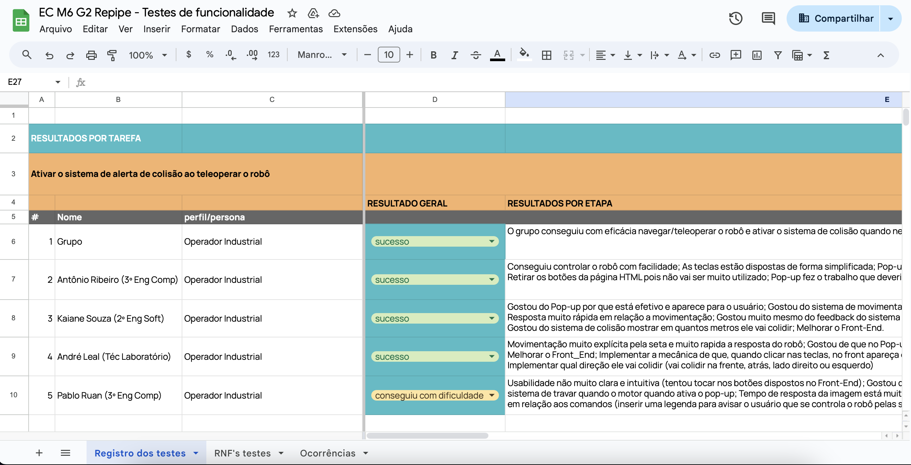
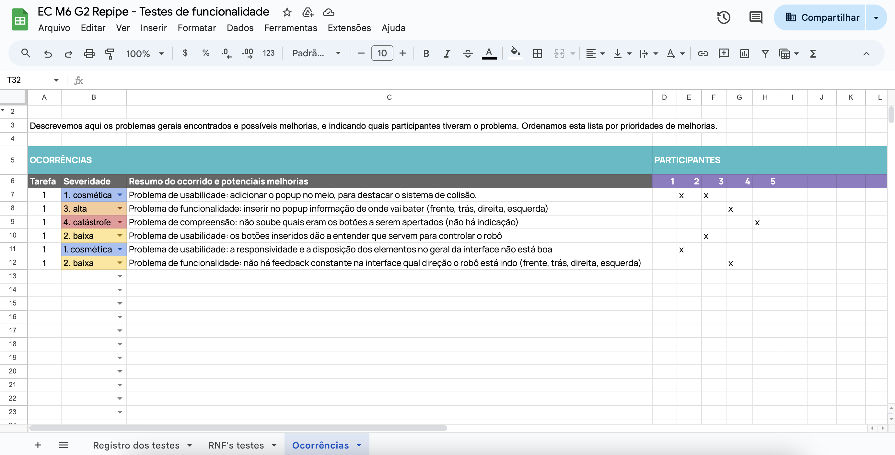

Este documento é responsável por detalhar testes de funcionalidade para requisitos funcionais e testes de validação para requisitos não funcionais. 

Os requisitos funcionais estabelecidos anteriormente podem ser visualizados [aqui](https://inteli-college.github.io/2024-1B-T08-EC06-G02/sprint_1/programacao/requisitos_funcionais), já os requisitos não funcionais neste [link](https://inteli-college.github.io/2024-1B-T08-EC06-G02/sprint_1/programacao/requisitos_nao_funcionais). 

# Testes de funcionalidade: requisito funcional
## Contexto
Dos requisitos funcionais estabelecidos anteriormente, escolhemos o:

**RF03**: O robô deve ter um sistema de colisão. Neste requisito, o Operador Industrial estará pilotando o robô via controle remoto. No entanto, caso o robô se aproxime a uma determinada distância de um objeto ou ser vivo, o alerta será acionado na tela para notificar o usuário.

O RF escolhido se dá pela sua importância na teleoperação do robô e por mesclar fatores como controle pela interface gráfica, sistema de colisão e alerta acionado. 

## Roteiro de teste
Todo teste é seguido por uma **tarefa**. E toda tarefa é realizada por um **perfil/persona** que obtém um **resultado geral** e um resultado **por etapas**. 

Sendo assim, para garantir que o RF esteja de acordo com o estabelecido, criamos critérios para avaliar se o teste foi realizado com sucesso ou não. 

No geral, avaliamos 4 fatores: 

1. Tarefa a ser realizada
2. Perfil/persona que está realizando o teste;
3. Resultado geral: sucesso, conseguiu com dificuldade e não conseguiu;
4. Resultado por etapa: descrição detalhando o ocorrido.  

E a condução dos testes deve acontecer da seguinte forma:
1. Explicação do projeto para o testador, destacando o objetivo (tarefa) a ser realizada e a posição como persona.
2. Realizar o setup previamente do robô: rodar a interface, o BringUp do turtlebot, a conexão WebSocket e o envio dos dados da câmera.
3. Fornecer o notebook para teleoperar o robô e anotar as informações coletadas. 

## Relatório de execução

Os testes foram executados por 4 pessoas, além do teste realizado pelo grupo. Os resultados podem ser visualizados [neste arquivo](https://docs.google.com/spreadsheets/d/1FnYlsAU4UXWCYReaynA9F_aY9sgXys9OXnpAjph5xss/edit?usp=sharing) do Google Sheets.

No geral, este foi o resultado obtido: 

| Tarefa | Perfil/Persona | Resultado Geral |
|--------|----------------|----------------|
|   1    | Operador Industrial | Sucesso | 
|   1    | Operador Industrial | Conseguiu com dificuldade |
|   1    | Operador Industrial | Não conseguiu |
|   1    | Operador Industrial | Sucesso |
|   1    | Operador Industrial | Sucesso |

Além disso, destacamos os principais problemas observados, classificando por nível de severidade e potenciais melhorias. Isto pode ser observado na segunda aba "ocorrências" do [mesmo arquivo](https://docs.google.com/spreadsheets/d/1FnYlsAU4UXWCYReaynA9F_aY9sgXys9OXnpAjph5xss/edit?usp=sharing)  Google Sheets.

## Conclusão
Completar

# Testes de validação: requisito não funcional
## Contexto
## Roteiro de teste
## Relatório de execução
## Conclusão