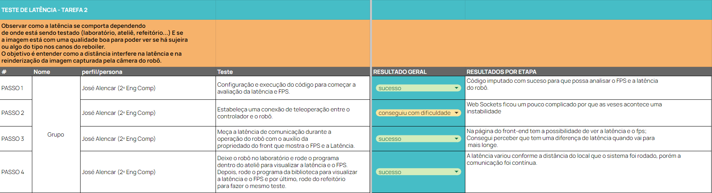
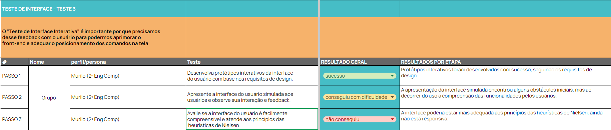

# Teste de Requisitos 

Este documento é responsável por detalhar testes de funcionalidade para requisitos funcionais e testes de validação para requisitos não funcionais. 

Os requisitos funcionais estabelecidos anteriormente podem ser visualizados [aqui](https://inteli-college.github.io/2024-1B-T08-EC06-G02/sprint_1/programacao/requisitos_funcionais), já os requisitos não funcionais neste [link](https://inteli-college.github.io/2024-1B-T08-EC06-G02/sprint_1/programacao/requisitos_nao_funcionais). 

## Testes de funcionalidade: requisito funcional
### Contexto
Dos requisitos funcionais estabelecidos anteriormente, o escolhido foi:

**RF03**: O robô deve ter um sistema de colisão. Neste requisito, o Operador Industrial estará pilotando o robô via controle remoto. No entanto, caso o robô se aproxime a uma determinada distância de um objeto ou ser vivo, o alerta será acionado na tela para notificar o usuário.

O RF escolhido se dá pela sua importância na teleoperação do robô e por mesclar fatores como controle pela interface gráfica, sistema de colisão e alerta acionado. 

### Roteiro de teste
Todo teste é seguido por uma **tarefa**. E toda tarefa é realizada por um **perfil/persona** que obtém um **resultado geral** e um resultado **por etapas**. 

Sendo assim, para garantir que o RF esteja de acordo com o estabelecido, foram criados critérios para avaliar se o teste foi realizado com sucesso ou não. O RF escolhido, neste caso, é a tarefa. 

No geral, foram avaliados 4 fatores: 

1. Tarefa a ser realizada
2. Perfil/persona que está realizando o teste;
3. Resultado geral: sucesso, conseguiu com dificuldade e não conseguiu;
4. Resultado por etapa: descrição detalhando o ocorrido.  

E a condução dos testes deve acontecer da seguinte forma:
1. Explicação do projeto para o testador, destacando o objetivo (tarefa) a ser realizada e a posição como persona.
2. Realizar o setup previamente do robô: rodar a interface, o BringUp do turtlebot, a conexão WebSocket e o envio dos dados da câmera.
3. Fornecer o notebook para teleoperar o robô e anotar as informações coletadas. 

### Relatório de execução

<h6 align="center"> Fonte: Elaboração Grupo Repipe </h6>

Os testes foram executados por 4 pessoas, além do teste realizado pelo grupo. Os resultados podem ser visualizados [neste arquivo](https://docs.google.com/spreadsheets/d/1FnYlsAU4UXWCYReaynA9F_aY9sgXys9OXnpAjph5xss/edit?usp=sharing) do Google Sheets.

No geral, este foi o resultado obtido: 

| Tarefa | Usuários | Perfil/Persona | Resultado Geral |
|--------|---------|----------------|----------------|
|   1    | Grupo   | Operador Industrial | Sucesso |
|   1    | Antônio Ribeiro (3º Eng Comp)   | Operador Industrial | Sucesso | 
|   1    | Kaiane Souza (2º Eng Soft)   | Operador Industrial | Sucesso |
|   1    | André Leal (Téc Laboratório)   | Operador Industrial | Sucesso |
|   1    | Pablo Ruan (3º Eng Comp)   | Operador Industrial | Conseguiu com dificuldade |

Além disso, destacou-se os principais problemas observados, classificando por nível de severidade e potenciais melhorias. Isto pode ser observado na segunda aba "ocorrências" do [mesmo arquivo](https://docs.google.com/spreadsheets/d/1FnYlsAU4UXWCYReaynA9F_aY9sgXys9OXnpAjph5xss/edit?usp=sharing) Google Sheets.

Nele também é possível observar se o problema relatado é um problema de funcionalidade, usabilidade ou compreensão. 


<h6 align="center"> Fonte: Elaboração Grupo Repipe </h6>


### Conclusão
Como conclusão do teste de funcionalidade realizado, foram recebidos os seguintes feedbacks:

1.	Controle fácil do robô.
2.	Movimentação intuitiva via teclado.
3.	Resposta rápida para movimentação.
4.	Sistema de alerta via pop-up eficaz.
5.	Resposta rápida do vídeo e imagem.

E como pontos de melhoria, foram obtidos os seguintes pontos: 

1.	**Posicionamento do Pop-up**: Mover o pop-up para o centro da tela para destacar mais eficazmente o sistema de colisão.
2.	**Informações adicionais no Pop-up**: Inserir no pop-up informações sobre a direção da colisão (frente, trás, direita, esquerda) para ajudar na orientação do usuário.
3.	**Indicação dos botões**: Fornecer indicações claras de quais botões devem ser apertados, possivelmente destacando-os visualmente ou incluindo legendas explicativas.
4.	**Feedback constante na interface**: Implementar um sistema que ofereça feedback constante sobre a direção em que o robô está se movendo, usando, por exemplo, indicações de cor nos botões ou setas.
5.	**Melhoria na disposição dos elementos da interface**: Aperfeiçoar a responsividade e a disposição geral dos elementos na interface para melhorar a usabilidade e a estética geral.


## Testes de validação: requisito não funcional
### Contexto

Dos requisitos não funcionais estabelecidos anteriormente, os seguintes foram escolhidos:

1. **RNF01 - Autonomia do robô:** Diante da operação contínua do robô, durante o processo de limpeza, o mesmo deve ter autonomia necessária para verificar ao menos um reboiler, por vez. Sendo assim, é preciso ter uma autonomia de no mínimo 4 horas.

O RNF escolhido para compor os testes é considerado muito importante, pois é necessário entender a autonomia da bateria e seu comportamento quando todos os componentes estão operando simultaneamente (Raspberry Pi, câmera, motores). Este teste é crucial para analisar e determinar se é viável adicionar uma bateria mais potente para alimentar o robô, possibilitando maior autonomia no dia a dia na inspeção dos reboilers.

2. **RNF03 - Latência de comunicação** Visto que haverá uma teleoperação em tempo real do robô, o sitema deve ter uma latência de comunicação estável e baixa. Nesse caso, uma latência de no máximo 150ms, com picos de 30ms para mais ou menos.

O RNF escolhido se dá pela importância na teleoperação do robô e é de super importância esse dado ja que, a latência varia de forma com a distância e o ambiente onde esteja para se comunicar e controlar o robô.

3. **RNF05 - Interface interativa:** Com base no nível de letramento digital dos possíveis usuários, interface do usuário precisa ser facilmente compreendida ao primeiro contato e possuir os princípios das heurísticas de Nilsen. 

Esse RNF é de suma importância, pois permite compreender como o usuário interage com a página disponibilizada, facilitando o uso dos controles para comandar o robô. Através desses testes, pode-se ver se os comandos e teclas dispostos na tela estão fáceis para o usuário poder usar o robô com facilidade.
Partindo desse teste, é possível entender e aplicar modificações em nossa página com o auxílio dos feedbacks fornecidos.

### Roteiro de teste
Todo teste é seguido por uma **tarefa**. E toda tarefa é realizada por um **perfil/persona** que obtém um **resultado geral** e um resultado **por etapas**. 

Sendo assim, para garantir que o RNF esteja de acordo com o estabelecido, foram criados critérios para avaliar se o teste foi realizado com sucesso ou não. 

No geral, foram avaliados 4 fatores: 

1. Tarefa a ser realizada
2. Perfil/persona que está realizando o teste;
3. Resultado geral: sucesso, conseguiu com dificuldade e não conseguiu;
4. Resultado por etapa: descrição detalhando o ocorrido.

E a condução dos testes deve acontecer da seguinte forma:
1. Explicação do projeto para o testador, destacando o objetivo (tarefa) a ser realizada e a posição como persona.
2. Realizar o setup previamente do robô: rodar a interface, o BringUp do turtlebot, a conexão WebSocket e o envio dos dados da câmera.
3. Fornecer o notebook para teleoperar o robô e anotar as informações coletadas. 

## Tarefa para o teste de autonomia do robô
O "Teste de autonomia" em questão será realizado pelo grupo de desenvolvedores para observar o comportamento da bateria com todos os componentes em funcionamento e avaliar a duração suportada pela mesma. Este teste é crucial para compreender como o robô opera à medida que a bateria descarrega e determinar a autonomia total da bateria.

**1. Autonomia do Robô (RNF01):**
- Passo 1: Monte um ambiente controlado com obstáculos representativos e uma área de movimento para o robô.
- Passo 2: Crie um script que simule as atividades típicas do robô, como movimento, coleta de dados e comunicação.
- Passo 3: Pegue a bateria totalmente carregada 12.6V e acople no robô
- Passo 4: Lique um cronômetro e execute o script por um período e verifique se o consumo simulado de energia está dentro da capacidade da bateria do robô.
***OBS: É importante notar que o Turtlebot, por padrão, começa a emitir um sinal sonoro quando a tensão da bateria chega a 11.0V como medida de segurança. Quando o sinal sonoro começar, o cronômetro será interrompido para registrar a duração alcançada.***
- Passo 5: Após o início do apito, o cronômetro é interrompido e o tempo de funcionamento do robô é registrado.

### Relatório de execução
Segue imagem do relatório de execução de autonomia do robô com a bateria em 100% (12.6V):


<h6 align="center"> Fonte: Elaboração Grupo Repipe </h6>


Os testes foram executados pelo grupo de desenvolvedores. Os resultados podem ser visualizados[neste arquivo](https://docs.google.com/spreadsheets/d/1FnYlsAU4UXWCYReaynA9F_aY9sgXys9OXnpAjph5xss/edit#gid=1538901939) do Google Sheets.

No geral, este foi o resultado obtido: 

| #       | Nome          | Perfil/Persona                   | Teste                                                                                   | Resultado Geral |
|---------|---------------|----------------------------------|-----------------------------------------------------------------------------------------|-----------------|
| PASSO 1 | GRUPO         | Aluno (Cecília 2º Eng Comp)      | Monte um ambiente controlado com obstáculos representativos e uma área de movimento para o robô. | Sucesso         |
| PASSO 2 | GRUPO         | Aluno (Cecília 2º Eng Comp)      | Crie um script que simule as atividades típicas do robô, como movimento, coleta de dados e comunicação. | Sucesso         |
| PASSO 3 | GRUPO         | Aluno (Cecília 2º Eng Comp)      | Pegue a bateria totalmente carregada 12.6V e acople no robô | Sucesso         |
| PASSO 4 | GRUPO         | Aluno (Cecília 2º Eng Comp)      | Lique um cronômetro e execute o script por um período e verifique se o consumo simulado de energia está dentro da capacidade da bateria do robô.| Sucesso  |
| PASSO 5 | GRUPO         | Aluno (Cecília 2º Eng Comp)      | Depois que apitou, parâmos o cronômetro e vemos quanto tempo deu de funcionamento do robô. | Sucesso         |

Além disso, são destacados os principais problemas observados, classificando por nível de severidade e potenciais melhorias. Isto pode ser observado na segunda aba "ocorrências" do [mesmo arquivo](https://docs.google.com/spreadsheets/d/1FnYlsAU4UXWCYReaynA9F_aY9sgXys9OXnpAjph5xss/edit?usp=sharing)  Google Sheets.

### Conclusão
Os testes demonstraram que o robô não alcançou o objetivo inicial de quatro horas de operação, operando eficientemente por três horas e vinte minutos. A diferença de quarenta minutos sugere a possibilidade de aprimorar a gestão de energia ou otimizar os componentes do robô para aumentar a eficiência da bateria. Para avançar, torna-se fundamental investigar como diversas condições operacionais, incluindo variações de carga e condições ambientais, impactam a duração da bateria. A análise detalhada das ocorrências e reações registradas contribuirá para a identificação de pontos específicos de melhoria técnica, garantindo avanços contínuos na performance e na confiabilidade do robô em futuras implementações.

## Tarefa para o teste de latência
O "Teste de Latência" em questão será realizado pelo grupo de desenvolvedores para analisar como a latência varia dependendo da localização do computador utilizado e da execução do teste para controlar o robô. Será verificado se a persona/tester consegue enviar comandos ao robô e se este responde adequadamente com movimentação. Durante o teste, também será avaliado o tempo de renderização da imagem, permitindo que o operador visualize o que a câmera está transmitindo com qualidade suficiente para detectar sujeiras ou qualquer tipo de defeito nos canos do reboiler.

**2. Latência de Comunicação (RNF03):**
- Passo 1: Configuração e execução do código para começar a avaliação da latência e FPS.
- Passo 2: Estabeleça uma conexão de teleoperação entre o controlador e o robô.
- Passo 3: Meça a latência de comunicação durante a operação do robô com o auxílio da propriedado do front que mostra o FPS e a Latência.
- Passo 4: Deixe o robô no laboratório e rode o programa dentro do ateliê para visualizar a latência e o FPS. Depois, rode o programa da biblioteca para visualizar a latência e o FPS e por último, rode do refeitório para fazer o mesmo teste.

### Relatório de execução
Segue imagem do relatório de execução da latência e FPS do robô:


<h6 align="center"> Fonte: Elaboração Grupo Repipe </h6>

Os testes foram executados pelo grupo de desenvolvedores. Os resultados podem ser visualizados [neste arquivo](https://docs.google.com/spreadsheets/d/1FnYlsAU4UXWCYReaynA9F_aY9sgXys9OXnpAjph5xss/edit#gid=1538901939) do Google Sheets.

No geral, este foi o resultado obtido: 

| #       | Nome          | Perfil/Persona                   | Teste                                                                                   | Resultado Geral |
|---------|---------------|----------------------------------|-----------------------------------------------------------------------------------------|-----------------|
| PASSO 1 | GRUPO         | Aluno (José Alencar 2º Eng Comp)      | Configuração e execução do código para começar a avaliação da latência e FPS. | Sucesso         |
| PASSO 2 | GRUPO         | Aluno (José Alencar 2º Eng Comp)      | Estabeleça uma conexão de teleoperação entre o controlador e o robô. | Conseguiu com dificuldade         |
| PASSO 3 | GRUPO         | Aluno (José Alencar 2º Eng Comp)      | Meça a latência de comunicação durante a operação do robô com o auxílio da propriedado do front que mostra o FPS e a Latência. | Sucesso         |
| PASSO 4 | GRUPO         | Aluno (José Alencar 2º Eng Comp)      | Deixe o robô no laboratório e rode o programa dentro do ateliê para visualizar a latência e o FPS. Depois, rode o programa da biblioteca para visualizar a latência e o FPS e por último, rode do refeitório para fazer o mesmo teste.| Conseguiu com dificuldade  |

Além disso, foram destacados os principais problemas observados, classificando por nível de severidade e potenciais melhorias. Isto pode ser observado na segunda aba "ocorrências" do [mesmo arquivo](https://docs.google.com/spreadsheets/d/1FnYlsAU4UXWCYReaynA9F_aY9sgXys9OXnpAjph5xss/edit#gid=1538901939)  Google Sheets.

### Conclusão
Os testes de latência e FPS do robô mostraram que ele, inicialmente, não manteve a latência dentro de limites aceitáveis em vários ambientes, incluindo alguns problemas iniciais com a conexão de teleoperação. 


<h6 align="center"> Fonte: Elaboração Grupo Repipe </h6>

A imagem acima demonstra o valor médio da latência ao medir em diferentes ambientes, que está em 1.5 segundos, ou, 1500ms. A nossa métrica exigia no máximo 150ms de latência, com picos de 30ms para mais ou menos. 

Os resultados indicam que a otimização contínua é necessária, principalmente na conexão, para aumentar a eficiência operacional em ambientes difíceis. Além disso, é aconselhável realizar uma análise minuciosa das ocorrências com o objetivo de orientar melhorias e ajustes técnicos no futuro.

Propostas de melhoria estão detalhadas melhor na seção "Proposta de Melhoria". 

## Tarefa para o teste de interface interativa
O "Teste de Interface Interativa" será realizado pelo grupo de desenvolvedores para avaliar a usabilidade da interface do usuário. Este teste é fundamental para garantir que a interface seja facilmente compreendida ao primeiro contato, seguindo os princípios das heurísticas de Nielsen. Durante o teste, os desenvolvedores observarão como os usuários interagem com a interface, identificando possíveis dificuldades e coletando feedback para melhorias. A realização deste teste é essencial para assegurar que os controles do robô sejam intuitivos e eficientes para todos os usuários, independentemente do seu nível de letramento digital.

### Heurísticas de Nielsen

As Heurísticas de Nielsen são um conjunto de dez princípios gerais para o design de interface de usuário, propostos por Jakob Nielsen. Elas servem como diretrizes para avaliar a usabilidade de um sistema. Aqui estão resumidamente:

1. ***Visibilidade do status:*** Informar sempre o usuário sobre o que está acontecendo.
2. ***Compatibilidade com o mundo real:*** Usar linguagem e conceitos familiares ao usuário.
3. ***Controle e liberdade:*** Fornecer formas fáceis de desfazer e refazer ações.
4. ***Consistência e padrões:*** Manter uniformidade no design e seguir convenções.
5. ***Prevenção de erros:*** Evitar que erros aconteçam com um design cuidadoso.
6. ***Reconhecimento em vez de lembrança:*** Tornar opções visíveis para reduzir a carga de memória.
7. ***Flexibilidade e eficiência:*** Permitir atalhos e personalização para usuários experientes.
8. ***Design estético e minimalista:*** Evitar informações irrelevantes ou desnecessárias.
9. ***Ajuda no reconhecimento de erros:*** Mensagens de erro claras e úteis.
10. ***Ajuda e documentação:*** Fornecer documentação fácil de buscar e usar.

Essas heurísticas são amplamente utilizadas no design de interfaces para melhorar a usabilidade e a experiência do usuário e essas heurísticas vão nos ajudar com as métricas e avaliações a serem feitas internamente.

**3. Interface Interativa (RNF05):**
- Passo 1: Desenvolva protótipos interativos da interface do usuário com base nos requisitos de design.
- Passo 2: Apresente a interface do usuário simulada aos usuários e observe sua interação e feedback.
- Passo 3: Avalie se a interface do usuário é facilmente compreensível e atende aos princípios das heurísticas de Nielsen.

### Relatório de execução
Segue imagem do relatório de visualização da interface interativa para controlar o robô e visualizar a imagem da câmera:


<h6 align="center"> Fonte: Elaboração Grupo Repipe </h6>

Os testes foram executados pelo grupo de desenvolvedores. Os resultados podem ser visualizados[neste arquivo](https://docs.google.com/spreadsheets/d/1FnYlsAU4UXWCYReaynA9F_aY9sgXys9OXnpAjph5xss/edit#gid=1538901939) do Google Sheets.

No geral, este foi o resultado obtido: 

| #       | Nome          | Perfil/Persona                   | Teste                                                                                   | Resultado Geral |
|---------|---------------|----------------------------------|-----------------------------------------------------------------------------------------|-----------------|
| PASSO 1 | GRUPO         | Aluno (Murilo 2º Eng Comp)      | Desenvolva protótipos interativos da interface do usuário com base nos requisitos de design. | Sucesso         |
| PASSO 2 | GRUPO         | Aluno (Murilo 2º Eng Comp)      | Apresente a interface do usuário simulada aos usuários e observe sua interação e feedback. | Conseguiu com dificuldade         |
| PASSO 3 | GRUPO         | Aluno (Murilo 2º Eng Comp)      | Avalie se a interface do usuário é facilmente compreensível e atende aos princípios das heurísticas de Nielsen. | Não deu certo         |

Além disso, foram destacados os principais problemas observados, classificando por nível de severidade e potenciais melhorias. Isto pode ser observado na segunda aba "ocorrências" do [mesmo arquivo](https://docs.google.com/spreadsheets/d/1FnYlsAU4UXWCYReaynA9F_aY9sgXys9OXnpAjph5xss/edit?usp=sharing)  Google Sheets.

### Conclusão
Os testes de interface interativa revelaram que, apesar do sucesso inicial no desenvolvimento dos protótipos, a interface enfrentou dificuldades em termos de usabilidade e não atendeu plenamente às heurísticas de Nielsen. Isso sublinha a necessidade de melhorias focadas em tornar a interface responsiva. Para futuros desenvolvimentos, recomenda-se revisar os elementos problemáticos com base no feedback dos usuários e realizar testes adicionais para garantir que a interface seja eficaz e satisfatória para o controle operacional do robô.

## Proposta de Melhoria
### Melhorar Bateria
Durante os testes, constatou-se que a bateria atual de 1800mAh não sustenta a operação do robô pelo período desejado de quatro horas. Através de análises comparativas e testes de desempenho, identificou-se que uma bateria de 2200mAh é capaz de atender a necessidade de maior autonomia. A substituição proposta visa não apenas alcançar as quatro horas de operação contínua mas também aumentar a confiabilidade do robô durante operações prolongadas, otimizando a eficiência operacional.

### Melhoria na Interface do Usuário
A avaliação da interface atual revelou falhas no cumprimento das heurísticas de Nielsen, principalmente relacionadas à visibilidade do sistema e feedback ao usuário. Para melhorar a interação, propõe-se centralizar os pop-ups de alerta, garantindo que eles captem eficientemente a atenção do usuário, além de implementar um design responsivo para adaptar a interface a diferentes dispositivos. Estas mudanças são esperadas para facilitar o entendimento e controle do robô pelos usuários, reduzindo o tempo de aprendizado e aumentando a satisfação e eficiência nas operações.

### Melhoria na latência 
Nota-se que há uma diferença muito grande na latência em: 
1. Rodar o WebSocket em outro computador ao invés de diretamente no robô; 
2. Calcular a latência no frontend ao invés de diretamente no robô; 

Por isso, foram implementadas duas mudanças, de rodar o websocket em outro computador: 

```bash 
ros2 launch rosbridge_server rosbridge_websocket_launch.xml # agora rodamos e outro computador
```

E também será retirado o cálculo da latência do robô para o frontend. No arquivo `sender.py` do robô, agora é enviado um timestamp para ser calculado no frontend.

```python
def timer_callback(self):
        ret, frame = self.cap.read()
        if ret:
            _, buffer = cv2.imencode('.jpg', frame)
            msg = CompressedImage()
            msg.format = "jpeg"
            msg.data = buffer.tobytes()
            # Define na mensagem o timestamp atual 
            msg.header = Header()
            msg.header.stamp = self.get_clock().now().to_msg()
            msg.header.frame_id = "camera_frame"
            self.publisher_.publish(msg)
```

Já no frontend, recebe-se a mensagem e calcula-se a diferença:

```javascript
    videoTopic.subscribe((message) => {
      const base64Data = message.data;
      setVideoSrc('data:image/jpeg;base64,' + base64Data);
    
      console.log('Received message header:', message.header);
      if (message.header && message.header.stamp) {
        const { sec, nanosec } = message.header.stamp;
    
        console.log('sec:', sec, 'nanosec:', nanosec);
    
        if (typeof sec === 'number' && typeof nanosec === 'number') {
          const now = new Date().getTime() / 1000; // Tempo atual em segundos
          const rosTimeInSeconds = sec + nanosec * 1e-9; // Tempo vindo do ROS em segundos
          const latency = now - rosTimeInSeconds; // Calcula a latencia com a diferença
    
          setLatencyData(latency.toFixed(3) + ' seconds');
        } else {
          console.error('Invalid or missing timestamp data');
          setLatencyData('Invalid timestamp data');
        }
      } else {
        console.error('No timestamp data available in the message header');
        setLatencyData('Missing timestamp data');
      }
    });
```

O resultado alcançado superou a métrica estabelecida anteriormente, que previa uma latência máxima de 150ms, apresentando variações de apenas 30ms para mais ou menos. A latência foi drasticamente reduzida, e tanto o envio dos dados da câmera e lidar quanto a troca das mensagens de movimentação ocorrem agora muito mais rapidamente.


<h6 align="center"> Fonte: Elaboração Grupo Repipe </h6>