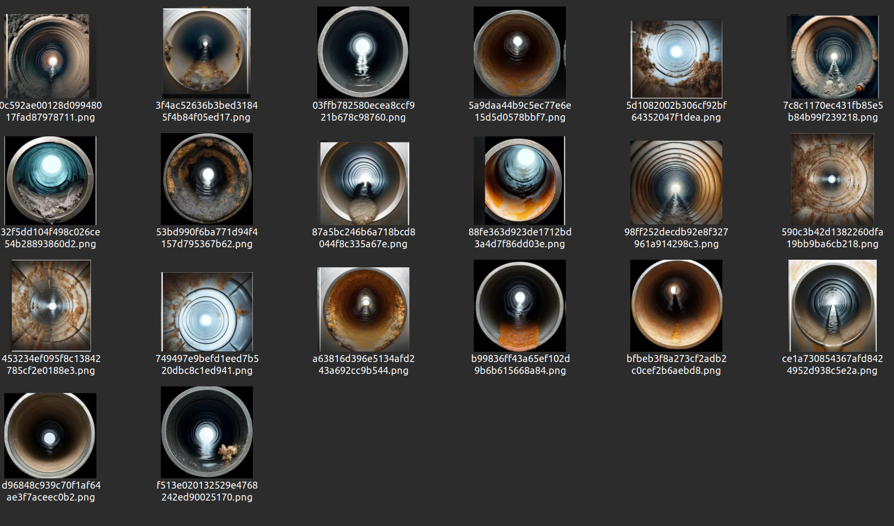

# Visão Computacional
Visão computacional é um campo da inteligência artificial que se concentra em capacitar os computadores a interpretar e compreender o mundo visual de maneira semelhante aos seres humanos. Essa disciplina envolve o desenvolvimento de algoritmos e modelos que permitem a um sistema extrair informações úteis de imagens e vídeos. As aplicações de visão computacional são amplas e variadas, incluindo o reconhecimento de objetos, detecção de rostos, análise de movimento, e segmentação de imagens.

Em termos técnicos, a visão computacional utiliza técnicas de processamento de imagem e aprendizado de máquina para analisar os dados visuais. Por exemplo, um sistema de visão computacional pode ser treinado para reconhecer diferentes tipos de frutas em uma imagem ao ser alimentado com um grande número de exemplos rotulados. O treinamento envolve a construção de modelos matemáticos que podem identificar padrões e características distintivas das frutas.

Nesse sentido, esta etapa do projeto envolveu a construção de um algoritmo de visão computacional para identificação de canos sujos. Além disso, para o treinamento, foi feita a construção de um banco de dados de imagens próprio. Assim, a primeira etapa foi a construção dessa base.

## Base de Dados
A base de dados deste projeto foi criada utilizando o Chat GPT-4 para gerar imagens que seriam utilizadas no início do treinamento. Esta medida se mostrou necessária devido à falta de imagens representativas da solução trabalhada em plataformas de bancos de imagens gratuitas, como Roboflow e Google. Assim, com o uso do Chat GPT-4, o conjunto de imagens geradas pode ser visto abaixo:

<h2 align="center">Base de dados para treinamento </h2>


<h6 align="center"> Fonte: Elaboração grupo Repipe </h6>

Tendo em mente essa base de dados, nota-se que há vários tipos de imagens em diferentes contextos, para que o modelo possa aprender com as diversas circunstâncias encontradas na solução.

Nessa perspectiva, com as imagens geradas, foi necessário transformá-las no modelo do YOLOv8. Em uma primeira instância, foi utilizado o **labelme** (que pode ser instalado pelo comando `pip install labelme`) para fazer a demarcação dos pontos que seriam analisados para o treino do modelo. Com isso, para cada uma das vinte imagens, foi gerado um arquivo no formato JSON com os pontos selecionados.

Após esse processo de demarcação dos pontos pelo software, foi feita a instalação do **Labelme2YOLO** através da clonagem do repositório `https://github.com/rooneysh/Labelme2YOLO.git`. Em seguida, foi executado o arquivo `labelme2yolo.py` para converter os arquivos .json para .txt. Além disso, esse script já faz a separação das imagens em treino e validação.

Por fim, com a base de imagens finalizada, deu-se início à construção do algoritmo para o treinamento e validação da visão computacional.


## Algoritmo de visão computacional
### Treinamento
No intuito de implementar o algoritmo de visão computacional, após a montagem da base de dados, deu-se o treinamento de fato do modelo.

Nesse sentido, neste projeto, primeiramente foram importados os recursos necessários para iniciar o treinamento do modelo pelo YOLOv8. Veja os *imports* abaixo:

```python
#  importação das dependencias necessárias
from ultralytics import YOLO
```

Nota-se que a Ultralytics é responsável por importar os módulos utilizados no modelo de treinamento do YOLO. Além disso, após a importação, foi instanciada uma variável para obter as características da classe YOLO, como no comando abaixo:

```python
model = YOLO()
```

Após esse processo de instância, a função para começar o treinamento do modelo com a base de dados criada pelo grupo foi colocada em uma variável chamada "resultados". Isso pode ser visto no comando abaixo::

```python
# treinamento do modelo
results = model.train(data="YOLODataset/dataset.yaml", epochs=100, imgsz=640)
```

### Predição
Nessa perspectiva, após o treinamento do modelo em 100 épocas, foi criado um arquivo PYTHON para realizar as predições do modelo treinado. Para isso, primeiramente foram feitas as importações das bibliotecas necessárias, conforme mostrado abaixo:

```python
#  importação das dependencias necessárias
from ultralytics import YOLO
import cv2
```

Depois das importações, foi instanciada uma variável denominada "model" para receber as informações da classe do YOLO e a base de dados gerada no treinamento, para que se pudesse analisar os resultados preditos. Além disso, foi instanciada uma variável chamada "cap" para fazer a captação das imagens da webcam. Esse processo pode ser visto no bloco de código abaixo:
```python
# instancia das variaveis
cap = cv2.VideoCapture(0) # indice 0 indica como a webcam é lida no sistemaz
model = YOLO("runs/detect/train6/weights/best.pt")
```
Após esse processo, foi criada uma condição para a inicialização da webcam e também uma variável chamada "results" para que a webcam fosse inicializada juntamente com a predição, permitindo que os resultados fossem mostrados no computador para o usuário. Essa parte pode ser vista no bloco de código abaixo:


```python
# condicional para iniciar a webcam 
if not cap.isOpened():
    print("Error: Could not open video source.")
else:
    # inicializacao da captancao das imagens
    cap.release()
    # aparesentacao das imagens em tempo real dizendo a predicao delas
    results = model.predict(source=0, show=True)
``` 
Por fim, com esse código implementado para treinamento e predição, o modelo pôde fornecer as primeiras impressões dos resultados das imagens captadas.